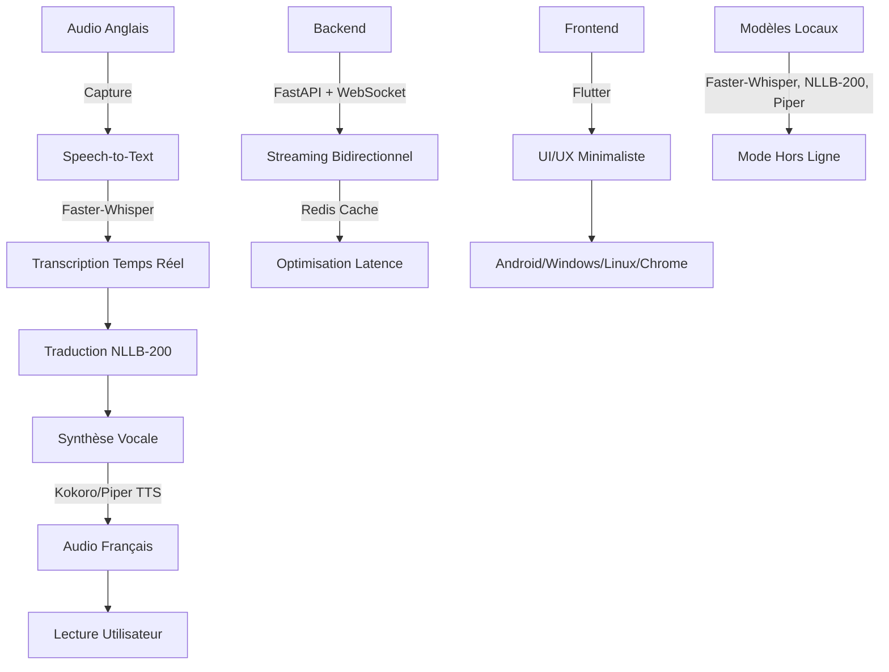

# eduvoice-fr
Donner à chaque francophone la possibilité d'apprendre directement auprès des meilleurs experts du monde en écoutant naturellement leurs enseignements en français


# EduVoice FR™ — Architecture & Roadmap

## 📌 **Vision**
Permettre aux francophones d'accéder aux meilleurs contenus éducatifs en anglais via une traduction vocale **temps réel**, naturelle et immersive.

---

## 🏗️ **Architecture Globale**



---

## 📂 **Structure du Projet**
```
eduvoice-fr/
├── backend/
│   ├── app/
│   │   ├── main.py          # FastAPI + WebSocket
│   │   ├── models/
│   │   │   ├── stt.py       # Faster-Whisper
│   │   │   ├── translation.py # NLLB-200
│   │   │   └── tts.py       # Kokoro/Piper
│   │   ├── services/
│   │   │   ├── audio_capture.py # WASAPI/PulseAudio/MediaProjection
│   │   │   └── cache.py     # Redis
│   │   └── schemas.py       # Pydantic
│   ├── Dockerfile
│   └── requirements.txt
│
├── frontend/
│   ├── lib/
│   │   ├── main.dart        # Flutter App
│   │   ├── screens/
│   │   │   ├── dashboard.dart
│   │   │   ├── history.dart
│   │   │   └── settings.dart
│   │   └── widgets/
│   └── pubspec.yaml
│
├── mobile/
│   ├── android/
│   │   └── AndroidManifest.xml # Permissions Audio
│   └── ios/                 # (Optionnel)
│
├── extension/
│   ├── manifest.json        # Chrome Extension
│   ├── background.js        # Audio Capture
│   └── popup/
│       └── index.html       # UI Bouton "Écouter en FR"
│
├── models/
│   ├── faster-whisper/      # Modèle STT
│   ├── nllb-200/            # Modèle Traduction
│   └── piper/               # Modèle TTS
│
├── docker/
│   └── docker-compose.yml   # Backend + Redis + PostgreSQL
│
├── tests/
│   ├── test_stt.py
│   ├── test_translation.py
│   └── test_tts.py
│
└── docs/
    ├── API.md
    ├── DEPLOYMENT.md
    └── USER_GUIDE.md
```

---

## 🛠️ **Technologies Clés**

| **Composant**          | **Technologie**               | **Rôle**                                  |
|------------------------|-------------------------------|-------------------------------------------|
| **Backend**            | Python 3.12 + FastAPI         | API REST + WebSocket pour le streaming    |
| **Base de Données**    | PostgreSQL + SQLite           | Stockage historique + cache Redis         |
| **Speech-to-Text**     | Faster-Whisper                | Transcription temps réel en anglais       |
| **Traduction**         | NLLB-200 (Meta)               | Traduction contextuelle anglais → français|
| **Synthèse Vocale**    | Kokoro TTS / Piper TTS        | Voix naturelles (masculine/féminine)      |
| **Frontend**           | Flutter                       | UI multiplateforme (Android/Windows/Linux)|
| **Extension Chrome**   | JavaScript + Manifest V3      | Bouton "Écouter en FR" sur YouTube        |
| **Audio Capture**      | WASAPI (Windows), PulseAudio (Linux), MediaProjection (Android) | Capture audio système |
| **Conteneurisation**   | Docker                        | Déploiement simplifié                     |

---

## 🎯 **Fonctionnalités Prioritaires**

### ✅ **Phase 1 : Core (MVP)**
- [ ] Capture audio depuis **YouTube** (extension Chrome + mobile)
- [ ] Transcription temps réel avec **Faster-Whisper**
- [ ] Traduction avec **NLLB-200** (cache Redis pour les phrases répétées)
- [ ] Synthèse vocale avec **Piper TTS** (voix française masculine/féminine)
- [ ] Streaming audio via **WebSocket** (latence < 5s)
- [ ] UI Flutter basique (bouton Play/Pause + volume)

### 🔜 **Phase 2 : Étendue**
- [ ] Support **Udemy, Coursera, Twitch, Zoom, Google Meet**
- [ ] Capture audio **locale** (fichiers vidéo/mp3)
- [ ] Sous-titres **bilingues** (anglais + français)
- [ ] Historique des traductions (SQLite/PostgreSQL)
- [ ] Export **PDF/DOCX/Markdown**

### 🚀 **Phase 3 : Avancée**
- [ ] **Mode hors ligne** (téléchargement des modèles)
- [ ] **Résumé IA** (points clés + quiz + fiche de révision)
- [ ] **Tableau de bord** (statistiques d'apprentissage)
- [ ] **Réglages audio** (vitesse, tonalité, volume)

---

## 📦 **Dépendances Backend (requirements.txt)**
```txt
fastapi==0.109.0
uvicorn==0.27.0
python-multipart==0.0.6
redis==5.0.1
whisper-faster==0.11.0  # Faster-Whisper
sentencepiece==0.2.0     # Pour NLLB-200
transformers==4.38.2    # HuggingFace (NLLB-200)
piper-tts==0.0.1         # Piper TTS
pydantic==2.5.3
sqlalchemy==2.0.23
psycopg2-binary==2.9.9
python-socketio==5.11.2
```

---

## 📱 **Dépendances Frontend (pubspec.yaml)**
```yaml
name: eduvoice_fr
description: Traducteur vocal intelligent pour l'apprentissage.

environment:
  sdk: '>=3.0.0 <4.0.0'

dependencies:
  flutter:
    sdk: flutter
  cupertino_icons: ^1.0.2
  provider: ^6.1.1
  socket_io_client: ^2.0.0
  audioplayers: ^5.0.0
  permission_handler: ^11.1.0
  shared_preferences: ^2.2.2
  path_provider: ^2.1.1
  flutter_markdown: ^0.6.15

dev_dependencies:
  flutter_test:
    sdk: flutter
  flutter_lints: ^2.0.0
```

---

## 🚀 **Prochaines Étapes**
1. **Initialiser le backend** :
   - Créer le projet FastAPI avec WebSocket.
   - Intégrer Faster-Whisper pour la transcription.
   - Ajouter NLLB-200 pour la traduction.

2. **Développer le frontend Flutter** :
   - UI pour contrôler la lecture/arrêt.
   - Connexion WebSocket au backend.

3. **Extension Chrome** :
   - Bouton "Écouter en FR" injecté sur YouTube.
   - Capture audio via `chrome.tabCapture`.

4. **Tests** :
   - Vérifier la latence (< 5s).
   - Tester la qualité de la synthèse vocale.

---

## ❓ **Questions Ouvertes**
- **Modèles** : Faut-il fine-tuner NLLB-200 pour des termes techniques (ex: développement, médecine) ?
- **Latence** : Comment optimiser le pipeline STT → Traduction → TTS pour < 2s ?
- **Déploiement** : Hébergement backend (VPS, Cloud) ?
- **Monétisation** : Modèle freemium (modèles premium pour voix haut de gamme) ?

---

## 📝 **Notes**
- **Priorité** : Commencer par le **MVP (YouTube + Flutter)** avant d'étendre aux autres plateformes.
- **Optimisation** : Utiliser des **workers async** pour éviter les blocages.
- **Sécurité** : Chiffrer les données audio si stockage local.
